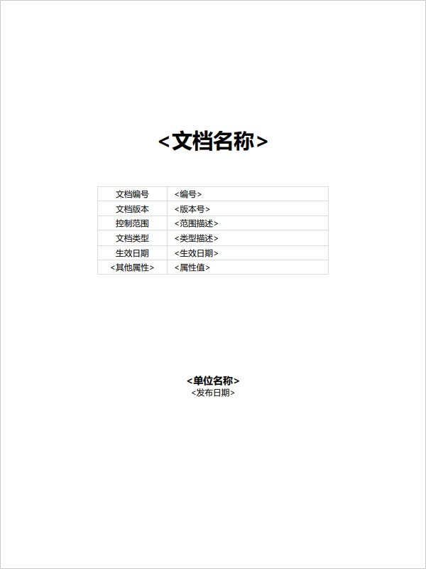

# 技术文档标准 <br> Technical Document Standard

```metas
文档版本: 1.16
控制范围: 公开
编制单位: forw.cc
发布日期: 2023-11-01
```

## 前言

本文档按照自己给出的规则起草。

本文档重点参考了 GB/T 1.1《标准化工作导则 第 1 部分：标准化文件的结构和起草规则》所规定的内容，但未进行规范性引用。

本文档的主要起草人：TYX、LHT。

## 引言

编写文档时要考虑的事情太多，覆盖是否全面、依据是否可取、概念是否清晰、取舍是否合理、衔接是否恰当、表述是否到位……，林林总总，想要面面俱到难度颇高。为了编写文档时能集中精力在核心内容、在关键部分，我们编制了本标准。

本标准面向技术文档，为统一文档结构、规范文档要素、提高文档效率、降低文档编制难度而设计，致力于帮助个人、组织编制高质量的技术文档。

起草本标准的过程中，文档结构、要素方面重点参考了 GB/T 1.1 这个权威的、编写标准的标准，但细节方面进行了大幅裁减、调整。还引入了“单页文档”和“类纸文档”两个重要概念，并基于“单页文档”的特点，在结构、细节方面进行了扩充，使得本标准同时适用于“单页文档”和“类纸文档”的编写。同时，还增加了表述方面的规定，对容易产生歧义的表述方式进行了取舍。

## 范围

本文档描述了起草标准化技术文档的规则。本文档没有描述与编制过程控制相关的征求意见、技术审查等程序活动。

本文档适用于中文约束性文档的起草，如：需求、要求、规定、规范、规程等。本文档不适用于解释性文档的起草，如：教程、教材等。说明类文档、方案类文档、英文技术文档的起草可以参照使用。

## 规范性引用

下列文档是本文档的组成部分。凡是注日期的引用文档，仅注日期的版本适用于本文档。凡是不注日期的引用文档，其最新版本（包括所有的修改单）适用于本文档。

- GB/T 20000.1 《标准化工作指南 第 1 部分：标准化和相关活动的通用术语》
- GB/T 15834 《标点符号用法》
- GB 3100 《国际单位制及其应用》
- GB 3101 《有关量、单位和符号的一般原则》
- GB 3102 《量和单位》的所有部分

## 术语和定义

GB/T 20000.1 界定的术语和定义适用于本文档。

下列术语和定义也适用于本文档。

### 文档 Document

文档是信息及其载体的集合，也称文件。

### 单页文档 Single Page Document

内容连续展示的不分页文档。如：Web 页、文本文档等。

### 类纸文档 Paper Like Document

纸质文件以及模仿纸质文件的布局方法、阅读体验，将内容分割到若干页面中进行展示的电子文档。如：纸质打印文件、Word 文档、PDF 文档等。

### 无序列表 Unordered List

改变列表成员的顺序，不会改变所传达信息的列表形式。

### 有序列表 Ordered List

改变列表成员的顺序，会改变所传达信息的列表形式。

### 多级编号 Multilevel Numbering

用 "." 分节，用节反应级别的编号形式。

### 多级编号标题 Multilevel Numbering Heading

带多级编号的标题。

### 多级编号段落 Multilevel Numbering Paragraph

带多级编号的段落。其编号从标题延续。

### 规范性 Normative

设定范围、提出要求的性质。

### 资料性 Informative

帮助理解的性质。

## 符号与缩略语

下列符号适用于本文档。

- < >：变量符号，其中的内容是关于变量值的描述。
- XXX：代表一个名词。
- YYY：代表一个标题或段落。

下列缩略语适用于本文档。

- N/A：表示不适用 (Not applicable)。
- URL：统一资源定位符 (Uniform Resource Locator)。

## 总则

**只提要求**。以规范结果为目的，只提要求，不解释。

**无歧义**。消除歧义最重要，优先于美观、简练、优雅等。

**结构化**。用形式传递信息，便于阅读，便于理解，便于抓住重点。

**自洽**。形式自洽、内容自洽、内涵自洽。

**方便使用**。面向行动，站在使用者的角度思考，阅后能行动。

**方便沟通时引用**。方便语音、文字等方式沟通时，进行精确的局部、全部引用。

**方便其他文档引用**。为建立宏大体系提供可能。

**方便管理**。方便编写、修改、收发、维护等工作的进行。

**方便知识化**。方便内容归档、方便机器检索、采集。

**方便呈现、保存**。方便以在线、电子文件、纸质打印件等多种方式呈现、保存。

## 结构

### 单页文档

| 文档要素     | 正文 | 必要性 |  要素标题的内容  | 要素标题的级别 |
| ------------ | :--: | :----: | :--------------: | :------------: |
| 文档名称     |      |  必备  |     文档名称     |       1        |
| 元信息       |      |  可选  |       N/A        |      N/A       |
| 目录         |      |  可选  |      “目录”      |       2        |
| 前言         |      |  可选  |      “前言”      |       2        |
| 引言         |      |  可选  |      “引言”      |       2        |
| 范围         |  √   |  可选  |      “范围”      |       2        |
| 规范性引用   |  √   |  可选  |   “规范性引用”   |       2        |
| 术语和定义   |  √   |  可选  |   “术语和定义”   |       2        |
| 符号与缩略语 |  √   |  可选  |  “符号与缩略语”  |       2        |
| 总则         |  √   |  可选  |      按需要      |       2        |
| 系统构成     |  √   |  可选  |      按需要      |       2        |
| 核心表述     |  √   |  必备  |      按需要      |       2        |
| 附录         |      |  可选  | 格式约束下按需要 |       2        |
| 参考文献     |      |  可选  |    “参考文献”    |       2        |

### 类纸文档

| 文档要素         | 正文 | 必要性 |  要素标题的内容  | 要素标题的级别 |
| ---------------- | :--: | :----: | :--------------: | :------------: |
| 封面（含元信息） |      |  必备  |       N/A        |      N/A       |
| 目录             |      |  可选  |      “目录”      |       2        |
| 前言             |      |  可选  |      “前言”      |       2        |
| 引言             |      |  可选  |      “引言”      |       2        |
| 文档名称         |      |  必备  |     文档名称     |       1        |
| 范围             |  √   |  可选  |      “范围”      |       2        |
| 规范性引用       |  √   |  可选  |   “规范性引用”   |       2        |
| 术语和定义       |  √   |  可选  |   “术语和定义”   |       2        |
| 符号与缩略语     |  √   |  可选  |  “符号与缩略语”  |       2        |
| 总则             |  √   |  可选  |      按需要      |       2        |
| 系统构成         |  √   |  可选  |      按需要      |       2        |
| 核心表述         |  √   |  必备  |      按需要      |       2        |
| 附录             |      |  可选  | 格式约束下按需要 |       2        |
| 参考文献         |      |  可选  |    “参考文献”    |       2        |

## 要素

### 文档名称 Name

用来给出文档的名称。

### 封面 Cover

用来给出文档的各种属性。

内容包括文档名称、元信息中的各种属性等。

封面的形式见“附录 A”。

### 元信息 Meta

用来给出文档的各种属性。

属性包括但不限于：

- 文档编号 SN
- 文档版本 Version
- 控制范围 Range
- 文档类型 Type
- 编制单位 Organization
- 发布日期 Release
- 生效日期 Effective

形式为无表头表格。

### 目录 TOC

用来呈现文档的主要结构。

目录范围应从前言开始到文档最后。

在单页文档中，目录应为超链接列表。

在类纸文档中，目录应为带页码列表。

### 前言 Forward

用来给出本文档与其他文档、组织、人的关系信息。

内容宜包括：

- 起草所依据的标准。表述形式固定为"本文档按照《技术文档标准》给出的规则起草。"。
- 与其他文档的关系。
- 与代替文档的关系。
- 与有关专利、版权的关系。
- 文档的提出信息。表述形式为"本文档由……提出。"。
- 起草单位。表述形式为"本文档的主要起草单位：XXX、XXX、XXX、……。"。
- 起草人。表述形式为"本文档的主要起草人：XXX、XXX、XXX、……。"。
- 版本历史。

每个内容一个段落。

在类纸文档中，前言总是从新页开始。

### 引言 Introduction

用来给出理解本文档需要知道的背景信息。

内容宜包括：

- 编制原因。
- 编制目的。
- 编制思路。

每个内容一个段落。

在类纸文档中，引言总是从新页开始。

### 正文 Main Body

属于正文的要素统一进行多级编号。

正文的多级编号从 "1." 开始。

多级编号的方法见 B.1。

同一个父标题下的次级内容，应该彼此同类，要么同为标题，要么同为段落。

在类纸文档中，正文总是从新页开始。

### 范围 Scope

用来给出本文档内容的边界和本文档的适用范围。

描述内容边界时，表述形式为段落，内容形式为 “本文档描述了……。本文档没有描述……。”。

描述适用范围时，表述形式为段落，内容形式为 “本文档适用于……。本文档不适用于……。”。

只标题进行多级编号，段落不编号。

### 规范性引用 Normative References

用来给出本文档所依赖的其他文档以及具体部分。

第一个段落为引导语，内容应固定为 “下列文档是本文档的组成部分。凡是注日期的引用文档，仅注日期的版本适用于本文档。凡是不注日期的引用文档，其最新版本（包括所有的修改单）适用于本文档。”。

引导语之后为无序列表。

一个引用一个列表项。

只标题进行多级编号，段落不编号。

### 术语和定义 Terms and Definitions

用来明确文档中所使用的概念。

如果引用其他文档的术语和定义，表述形式为“ XXX 界定的术语和定义适用于本文档。”。

如果自己界定术语和定义，应用引导语引出，引导语固定为“下列术语和定义（也）适用于本文档。”。

自己界定术语和定义时，术语应提供相应的英文翻译词。

自己界定术语和定义时，术语及其对应的英文为 3 级标题。

自己界定术语和定义时，术语定义的表述形式为段落。

只标题进行多级编号，段落不编号。

### 符号和缩略语 Symbols and Abbreviations

用来给出文档中使用的符号、缩略语的说明。

符号为无序列表形式。

符号列表用引导语引出，引导语固定为“下列符号适用于本文档。”。

一个符号及其说明为一个列表项。

符号与其说明用冒号分开。

缩略语为无序列表形式。

缩略语列表用引导语引出，引导语固定为“下列缩略语适用于本文档。”。

一个缩略语及其说明为一个列表项。

缩略语与其说明用冒号分开。

只标题进行多级编号，段落不编号。

### 总则

描述起草具体技术文档的过程中，面对选择时，总的决策原则、决策倾向、决策理念、决策方法。

按表述需要使用所有可用形式。

标题、段落都进行多级编号。

### 系统构成

描述所涉及系统的全貌、组成部分、组成部分的关系、运行机制。

按表述需要使用所有可用形式。

标题、段落都进行多级编号。

### 核心表述

描述为达到编制目的所必须的表述。

按表述需要使用所有可用形式。

标题、段落都进行多级编号。

### 附录 Annex

当前言、正文中某些内容过长时，可以将细节移出，形成附录。

一个文档可以有多个附录。

附录的标题、段落都进行多级编号。

附录中 2 级标题的编号格式为 “附录 <编号字母>（<附录性质>）<附录名称>”。

附录的编号字母从 “A” 开始。

附录性质为“规范性”或“资料性”。

附录内容多级编号的第一节是编号字母，其他为数字。

多级编号的方法见 B.2。

按表述需要使用所有可用形式。

附录可以展开内容，也可以引用电子文件或其他文档。

在类纸文档中，附录总是从新页开始。

### 参考文献 Bibliography

用来给出文档起草过程中参考过的资料。

内容的形式为有序列表。

每个资料一个列表项。

列表项结尾不应有标点符号。

宜提供以下信息：

- 资料名称以及其他辨识信息。
- 作者（资料为标准、法规时不需要）。
- URL（资料来自网络时需要）。

信息用逗号分开。

信息中的资料名称应用书名号标记。

在类纸文档中，参考文献总是从新页开始。

## 表述

### 形式

可用的表述形式包括：

- 标题，包括：多级编号标题、不编号标题。
- 段落，包括：多级编号段落、不编号段落。
- 无序列表。
- 有序列表。
- 图。
- 表格。
- 示例。

1 级标题应居中显示。

2 级标题宜居中显示。

3 级和 3 级以下标题应左对齐。

图、表格、示例应安置在多级编号段落中。

段落不应首行缩进。

段落与段落之间应空一行的距离。

### 语言

统一用助动词“应”、“不应”表达约束程度。

- “应”表示明确的“必须”；
- “不应”表示明确的“不允许”；

```
错误示例：箭头必须向下。
正确示例：箭头应向下。
```

统一用助动词“宜”、“不宜”表达推荐程度。

- “宜”表示推荐、建议；
- “不宜”表示不推荐、不建议。

```
错误示例：尽量保证偏差不超过 5%。
正确示例：偏差宜小于 5%。
```

应使用冷静严肃的正式文体。

```
错误示例：张学友的演唱会真是酷毙了！！！
正确示例：无法参加本次活动，我深感遗憾。
```

代词应明确指代的内容，确保无歧义。

```
错误示例：从管理系统可以监视中继系统和受其直接控制的分配系统。
正确示例：从管理系统可以监视两个系统，中继系统和受中继系统直接控制的分配系统。
```

宜使用短句。

```
错误示例：

本产品适用于从由一台服务器进行动作控制的单一节点结构到由多台服务器进行动作控制的并行处理程序结构等多种体系结构。

正确示例：

本产品适用于多种体系结构。一台服务器进行动作控制的单一节点结构适用。多台服务器进行动作控制的并行处理程序结构也适用。
```

宜采用肯定方式表述。

```
错误示例：请确认没有接通装置的电源。
正确示例：请确认装置的电源已关闭。
```

不应使用双重否定。

```
错误示例：没有删除权限的用户，不能删除此文件。
正确示例：用户必须拥有删除权限，才能删除此文件。
```

### 文本

文本中的英文字符、阿拉伯数字应使用半角字符。

中文字符与英文字符之间，应有一个半角空格。

```
错误示例：本文介绍如何快速启动Windows系统。
正确示例：本文介绍如何快速启动 Windows 系统。
```

阿拉伯数字与英文单位之间不应有空格。

```
错误示例：一部容量为 16 GB 的智能手机。
正确示例：一部容量为 16GB 的智能手机。
```

英文字符、阿拉伯数字，与全角标点符号之间不应有空格。

```
错误示例：他的电脑是 MacBook Air 。
正确示例：他的电脑是 MacBook Air。
```

### 符号

除另有规定外，文本中的标点符号应使用全角中文标点符号。

成对出现的标点符号，如果其标记的内容全是英文，应使用半角英文标点符号。

```
错误示例：苹果公司（Apple Inc.）是一家美国的跨国科技公司。
正确示例：苹果公司 (Apple Inc.) 是一家美国的跨国科技公司。
```

处于英文之间的标点符号，应使用半角英文标点符号。

```
错误示例：这让我想起了那句话：Love well，whip well。
正确示例：这让我想起了那句话：Love well, whip well。
```

独立成段的英文，标点符号应全部使用半角英文标点符号。

```plaintext
错误示例：

这是著名的热力学第一定律：

The total energy of an isolated system remains constant over time。

正确示例：

这是著名的热力学第一定律：

The total energy of an isolated system remains constant over time.

```

应采用全角浪纹号（～）表示范围，前值和后值的单位、量级、百分号、千分号都不应省略。

```
错误示例：2 ～ 5 ℃
正确示例：2 ℃ ～ 5 ℃
```

```
错误示例：2 ～ 5 万
正确示例：2 万 ～ 5 万
```

```
错误示例：2 ～ 5%
正确示例：2% ～ 5%
```

## 附录（规范性）封面的示意



## 附录（规范性）多级编号的示意

### 正文

```plaintext
1. YYY
2. YYY
3. YYY
4. YYY
5. YYY
6. YYY
6.1. YYY
6.2. YYY
6.3. YYY
6.3.1. YYY
6.3.2. YYY
6.3.3. YYY
6.4. YYY
6.4.1. YYY
6.4.2. YYY
6.4.2.1. YYY
6.4.2.2. YYY
6.4.2.3. YYY
6.4.2.4. YYY
6.4.2.5. YYY
6.4.3. YYY
6.4.4. YYY
6.4.5. YYY
6.5. YYY
7. YYY
```

### 附录

```plaintext
附录 A  YYY

附录 B  YYY
B.1. YYY
B.2. YYY
B.2.1. YYY
B.2.2. YYY
B.2.3. YYY
B.2.3.1. YYY
B.2.3.2. YYY
B.2.3.3. YYY
B.3. YYY

附录 C  YYY
C.1. YYY
C.2. YYY
```

## 参考文献

1. GB/T 1.1-2020《标准化工作导则 第 1 部分：标准化文件的结构和起草规则》
1. GB/T 20001.5-2017《标准编写规则 第 5 部分：规范标准》
1. 《中文技术文档的写作规范》，阮一峰，https://github.com/ruanyf/document-style-guide
